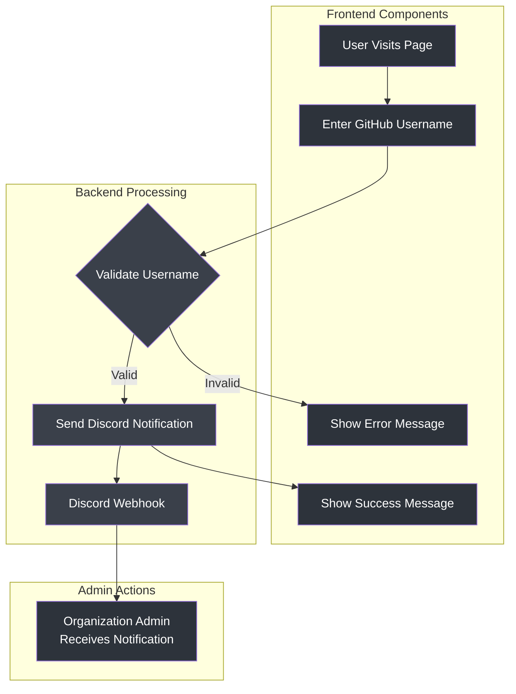

# GitHub Organization Request Page

A modern, interactive web application that allows users to request access to a GitHub organization. Built with vanilla JavaScript and TailwindCSS, featuring a sleek dark theme design inspired by shadcn and Vercel.


## 🌟 Features

- **Modern UI/UX**: Sleek dark theme with glass morphism effects
- **Interactive Elements**: Dynamic particle system and animations
- **Form Validation**: Real-time GitHub username verification
- **Discord Integration**: Automatic notifications via webhook
- **Responsive Design**: Optimized for all device sizes
- **SEO Optimized**: Complete metadata implementation

## 🔄 How It Works




## 📁 Project Structure

```plaintext
root/
├── index.html          # Main entry point
├── 404.html            # Custom error page
├── favicon.ico         # Site favicon
├── preview.png         # Social preview image
├── robots.txt          # Search engine configuration
├── sitemap.xml         # Site structure for SEO
└── js/
    ├── main.js             # Application initialization
    ├── particleSystem.js   # Background animation
    ├── formHandler.js      # Form processing
    └── discordWebhook.js   # Discord integration
```

## 🚀 Setup

1. Clone the repository:

```shellscript
git clone https://github.com/RedFox-Studios/redfox-studios.github.io.git
cd redfox-studios.github.io
```

2. Configure Discord webhook:
   - Open `js/discordWebhook.js`
   - Replace `YOUR_DISCORD_WEBHOOK_URL` with your actual Discord webhook URL


3. Deploy to GitHub Pages:
   - Go to repository settings
   - Navigate to "Pages"
   - Select your branch (usually `main`)
   - Save to deploy


## ⚙️ Configuration

### Discord Webhook

The application sends notifications to Discord when users request access. To configure:

1. Create a Discord webhook in your server
2. Copy the webhook URL
3. Update the `DISCORD_WEBHOOK_URL` in `js/discordWebhook.js`


### SEO Configuration

Update the metadata in `index.html` with your information:

```html
<meta property="og:url" content="https://redfox-studios.github.io/">
<meta property="og:title" content="Your Title">
<meta property="og:description" content="Your Description">
```

## 🎨 Customization

### Colors

The project uses TailwindCSS for styling. Main colors are:

- Background: Zinc-900 to Zinc-800 gradient
- Text: Zinc-100 to Zinc-400
- Accents: Various opacity levels of Zinc


### Fonts

- Main Font: Geist
- Monospace: Geist Mono
- Icons: Font Awesome


## 📱 Browser Support

- Chrome (latest)
- Firefox (latest)
- Safari (latest)
- Edge (latest)


## 🤝 Contributing

1. Fork the repository
2. Create your feature branch: `git checkout -b feature/AmazingFeature`
3. Commit your changes: `git commit -m 'Add some AmazingFeature'`
4. Push to the branch: `git push origin feature/AmazingFeature`
5. Open a pull request


## 📄 License

This project is licensed under the MIT License - see the [LICENSE](LICENSE) file for details.

## 🙏 Acknowledgments

- [TailwindCSS](https://tailwindcss.com)
- [Font Awesome](https://fontawesome.com)
- [Geist Font](https://vercel.com/font)