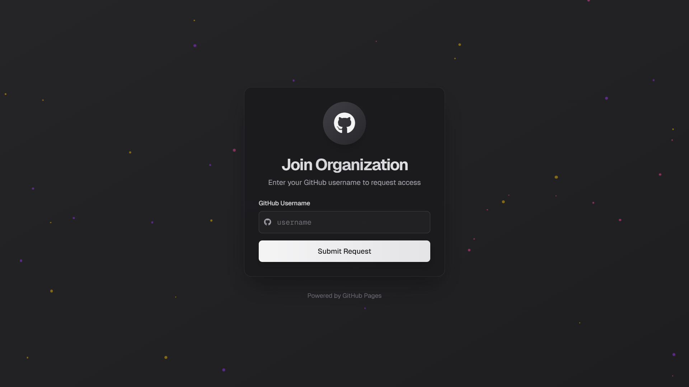

# GitHub Organization Request Page

A modern, interactive web page for GitHub Pages that allows users to request access to your GitHub organization. Features a sleek dark theme design with animated particles and Discord webhook integration.



## ✨ Features

- **Modern UI/UX**: Clean, dark-themed interface with glass morphism effects
- **Interactive Elements**: Animated particles and interactive GitHub icon
- **Form Validation**: Real-time GitHub username validation
- **Discord Integration**: Automatic notifications via Discord webhook
- **Custom 404 Page**: Styled error page matching the main theme
- **Responsive Design**: Works seamlessly on all device sizes
- **Animations**: Smooth transitions and loading states

## 🔄 How It Works


The diagram above illustrates the application's flow:
1. Users enter their GitHub username
2. The system validates the username through GitHub's API
3. If valid, it sends the request to Discord with user information
4. The background particle system provides continuous interactive animations
5. Success/error messages are displayed accordingly

## 🚀 Setup

1. **Clone this repository**
    ```bash
    git clone https://github.com/yourusername/organization-request-page.git
    cd organization-request-page
    ```

2. **Configure Discord Webhook**

1. Open `discordWebhook.js`
2. Replace `YOUR_DISCORD_WEBHOOK_URL` with your actual Discord webhook URL


3. **Deploy to GitHub Pages**

1. Go to your repository settings
2. Navigate to the "Pages" section
3. Select your branch (usually `main`) as the source
4. Your site will be available at `https://yourusername.github.io/`

## 🛠️ Technologies Used

- HTML5 & CSS3
- JavaScript (ES6+)
- [Tailwind CSS](https://tailwindcss.com) - Utility-first CSS framework
- [Font Awesome](https://fontawesome.com) - Icons
- [Geist Font](https://vercel.com/font) - Typography
- Discord Webhooks API


## ⚙️ Configuration

### Discord Webhook Setup

1. In your Discord server:
   - Go to Server Settings > Integrations
   - Click on "Create Webhook"
   - Choose the channel for notifications
   - Copy the webhook URL

2. In your code:
   - Open `discordWebhook.js`
   - Replace the placeholder URL:


```javascript
const DISCORD_WEBHOOK_URL = 'YOUR_DISCORD_WEBHOOK_URL';
```


### Custom Domain (Optional)

To use a custom domain:

1. Add a CNAME file to your repository
2. Configure your domain's DNS settings
3. Update your repository's GitHub Pages settings


## 🤝 Contributing

Contributions are welcome! Please feel free to submit a Pull Request.

1. Fork the repository
2. Create your feature branch (`git checkout -b feature/AmazingFeature`)
3. Commit your changes (`git commit -m 'Add some AmazingFeature'`)
4. Push to the branch (`git push origin feature/AmazingFeature`)
5. Open a Pull Request


## 📝 License

This project is licensed under the MIT License - see the [LICENSE](LICENSE) file for details.

## 🙏 Acknowledgments

- Design inspired by [Vercel](https://vercel.com) and [shadcn/ui](https://ui.shadcn.com)
- Particle animation system adapted from various open-source implementations
- Thanks to the GitHub Pages team for the hosting platform